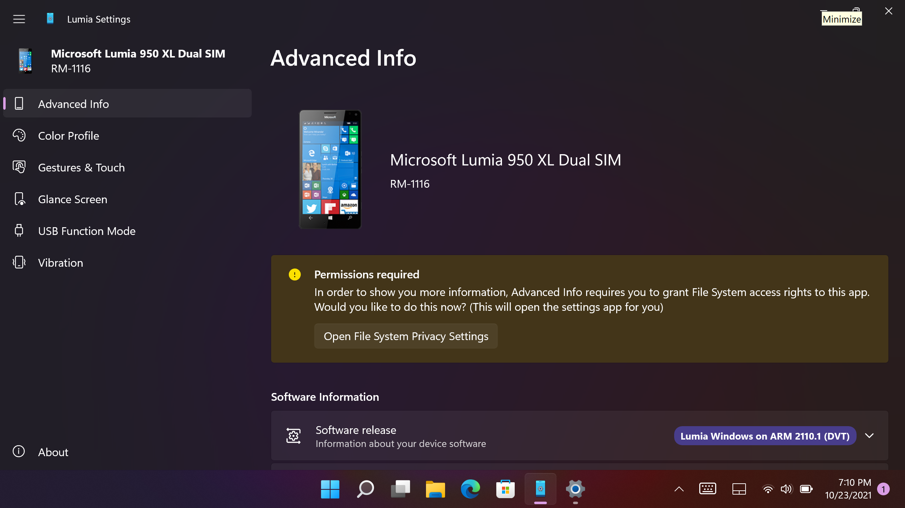

# Lumia Settings Application (LumiaApp)

Welcome to the LumiaApp repository! This repository hosts the source code for the Lumia Settings application shipped as part of the LumiaWOA project.

## Building Requirements

- Visual Studio 2019 or higher
- Windows 11 Build 22000 SDK or higher
- Windows 10 Build 17763 SDK
- Visual C++ Tools for the Universal Windows Platform (for ARM/ARM64)
